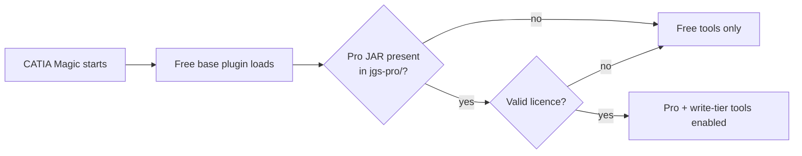

<!--
Copyright (c) 2026 JG Systems Consulting Ltd. All Rights Reserved.
SPDX-License-Identifier: LicenseRef-JGSystemsConsulting-Proprietary
-->

# SysML v1 MCP Bridge — Pro Extension

The compiled pro-extension plugin JAR for the **SysML v1 MCP Bridge** for CATIA Magic /
Cameo Systems Modeler. It unlocks the licensed (write-tier and pro) tool set on top of the
free base plugin.

## What this is

This repository distributes a single artifact: `jgs-sysmlv1-pro.jar`. It is **not** a
standalone application. At CATIA Magic startup the free base plugin loads this JAR
dynamically (via `URLClassLoader`) and, when a valid licence is present, enables the pro
tools. Without the free base plugin installed, the pro JAR does nothing.

> [!IMPORTANT]
> The **free base plugin must be installed first**. The pro JAR is loaded by the free
> plugin and silently does nothing if the free plugin is absent.



| File | Description |
|---|---|
| `jgs-sysmlv1-pro.jar` | Compiled pro-extension plugin JAR |
| `RELEASE-INFO.txt` | Version, intended tag, and SHA-256 digest of the JAR |
| `CHANGELOG.md` | Release history |

## Prerequisites

- CATIA Magic / Cameo Systems Modeler (or MSOSA) installed and licensed.
- The **free** SysML v1 MCP Bridge base plugin installed.
- A valid JG Systems Consulting pro licence file (shipped in your licence bundle).

## Install

Customers receive this JAR pre-packaged in their licence bundle (zip), alongside an
`AGENT-INSTALL.md` with automated steps. The JAR is copied into the free plugin's pro
directory:

```
<CATIA Magic install>\plugins\<plugin-dir>\jgs-pro\jgs-sysmlv1-pro.jar
```

Restart CATIA Magic after copying. Verify the digest against `RELEASE-INFO.txt`:

```bash
sha256sum jgs-sysmlv1-pro.jar   # must equal jar_sha256 in RELEASE-INFO.txt
```

### Install with your AI agent

Paste this into a coding agent (Claude Code, Cursor, etc.) to perform the install:

```
Install the JGS SysML v1 Pro extension JAR.
1. Read this repo's README.md and RELEASE-INFO.txt first.
2. Confirm the free SysML v1 MCP Bridge base plugin is already installed (prerequisite).
3. Copy jgs-sysmlv1-pro.jar into:
   <CATIA Magic install>/plugins/<plugin-dir>/jgs-pro/jgs-sysmlv1-pro.jar
4. Verify: sha256 of the copied JAR equals jar_sha256 in RELEASE-INFO.txt.
5. HUMAN-ONLY STEP: place your pro licence file and restart CATIA Magic — an agent
   cannot install a host-application plugin or restart the host for you.
Note the licence: proprietary, governed by LICENSE in this repo.
```

## Usage

Once the JAR is in place, the free base plugin loads it at startup. Pro and write-tier
tools become available to any connected MCP agent through the free bridge's MCP server —
there is no separate process to run from this repository. See the **free** SysML v1 MCP
Bridge for the tool reference and MCP client configuration.

## Licence

Proprietary. Governed by [`LICENSE`](LICENSE) (JG Systems Consulting Ltd. Proprietary
Software Licence). See [`COPYRIGHT`](COPYRIGHT) and [`NOTICE`](NOTICE) for attribution and
third-party notices.

## Support

- **Help / questions** — open an issue, or contact JG Systems Consulting Ltd.
- **Security** — see [`SECURITY.md`](SECURITY.md) (report via a private GitHub security
  advisory, not email).
- **Version / history** — see [`CHANGELOG.md`](CHANGELOG.md).
